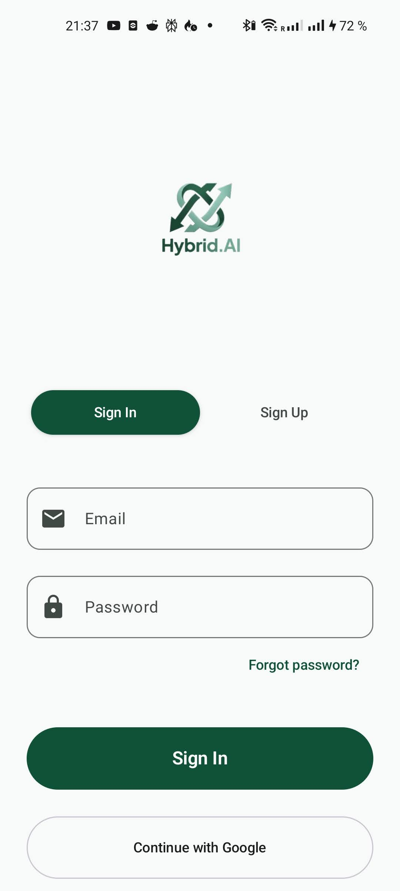
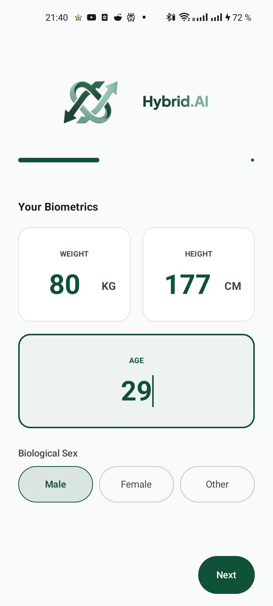
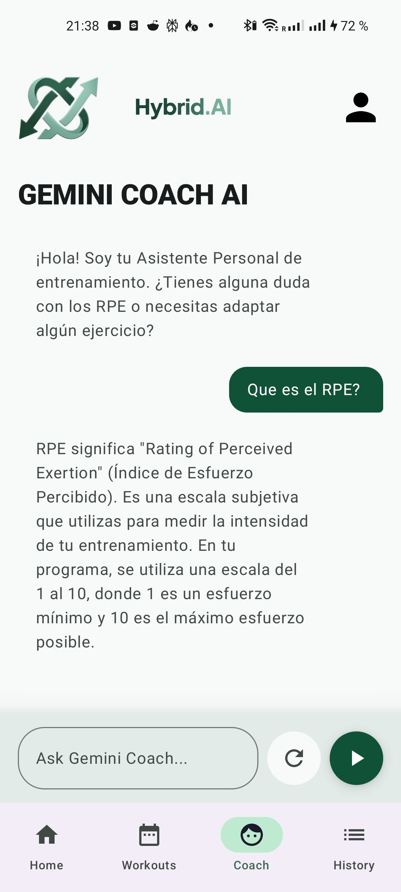
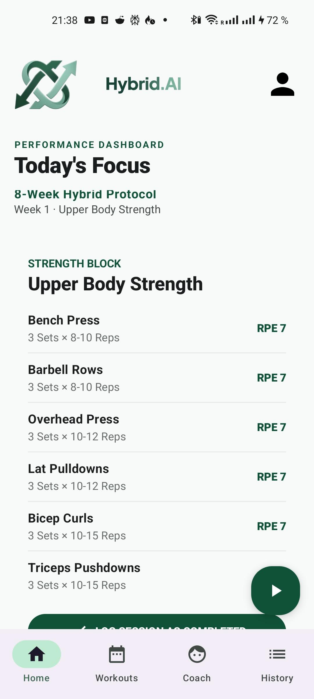
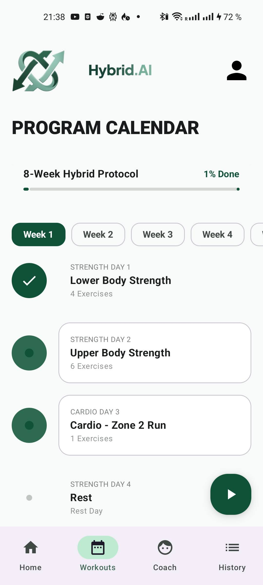
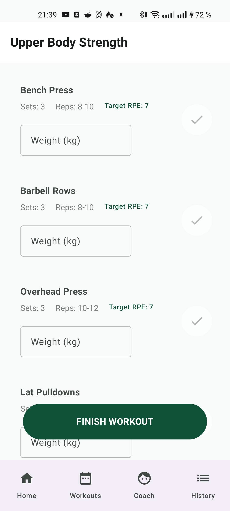
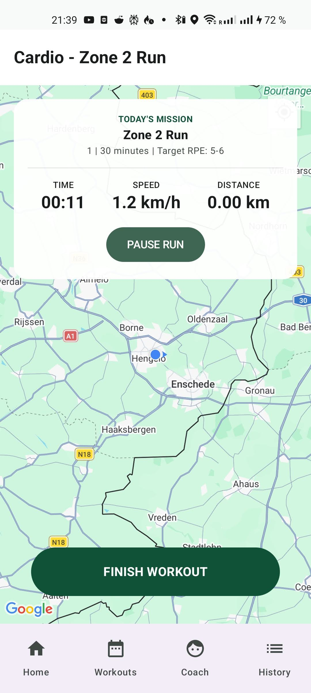
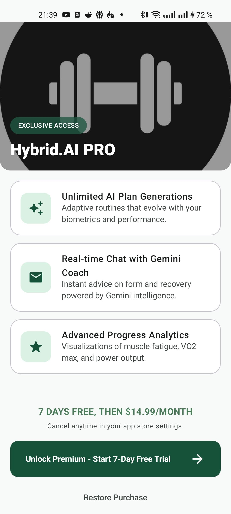
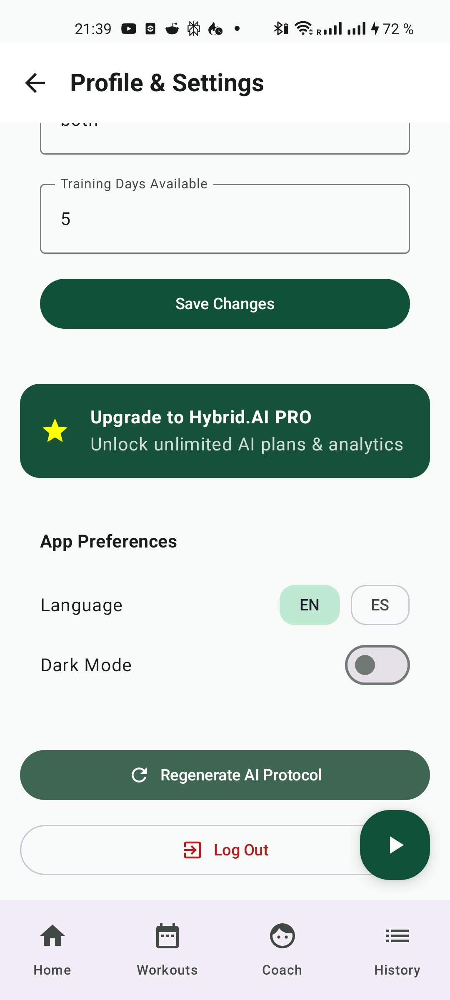

<div align="center">

# 🏃‍♂️🏋️ Hybrid.AI Training — Android Client

**An AI-powered hybrid training coach that generates adaptive strength & endurance plans and answers your questions through a conversational agent.**

Native Android app built with a modern, production-grade stack — Clean Architecture, MVVM, offline-first persistence, and a fully declarative Jetpack Compose UI.

<br/>


</div>

---

## 📖 Overview

**Hybrid.AI Training** is the native Android client of an adaptive coaching platform for athletes who train **both strength and endurance** ("hybrid" athletes). The user completes a guided onboarding — biometrics, goals, experience, availability, and (for female users) menstrual-cycle context — and a generative AI engine (**Google Gemini**) produces a personalized, multi-week training macrocycle. A conversational coach answers training questions in natural language, and an integrated GPS tracker records runs in real time.

The app is designed **offline-first**: once a plan is generated it lives in a local Room database, so workouts, history and progress are fully usable without connectivity.

> 🔒 **The app never talks to Gemini directly.** All AI runs behind a dedicated Node.js backend that owns the API keys, prompts and response schema — the client only ever sees a clean, versioned REST contract. This keeps secrets off the device and the prompt engineering server-side.

---

## 📱 Screenshots

<div align="center">

| Sign In | Onboarding | AI Coach |
|:---:|:---:|:---:|
|  |  |  |
| *Email or Google Sign-In* | *Guided biometric setup* | *Conversational Gemini coach* |

| Home Dashboard | Program Calendar | Workout Execution |
|:---:|:---:|:---:|
|  |  |  |
| *Today's focus & RPE targets* | *Multi-week plan with progress* | *Per-exercise session logging* |

| Live Run Tracking | Premium Paywall | Settings |
|:---:|:---:|:---:|
|  |  |  |
| *Real-time GPS & pace* | *Play Billing subscription* | *Language & dark mode* |

</div>

---

## ✨ Key Features

| | Feature | Description |
|---|---|---|
| 🤖 | **AI plan generation** | Guided multi-step onboarding feeds Gemini (via backend) to produce an adaptive strength + running macrocycle. |
| 💬 | **Conversational coach** | In-app chat with an AI coach for training questions (`POST /api/ai/chat`). |
| 📅 | **Cycle-aware onboarding** | Female users can register their last period start date so future plans can adapt to the menstrual cycle. |
| 📴 | **Offline-first** | Plans, progress and workout history persist locally in Room and work without a connection. |
| 🏃 | **Live GPS run tracking** | Foreground location service + Google Maps to record runs (distance, route) in real time. |
| 📊 | **Progress & history** | Weekly completion tracking, workout logs, and per-exercise metrics. |
| 🔐 | **Google Sign-In + JWT** | OAuth 2.0 sign-in exchanged for a backend-issued JWT, attached automatically to every request. |
| 💳 | **Premium paywall** | Google Play Billing integration for premium features. |
| 🌗 | **Dark mode & i18n** | User-toggleable dark theme and full localization (English 🇬🇧 / Spanish 🇪🇸) applied at runtime without restarting. |

---

## 🏛️ Architecture

The app follows **Clean Architecture** with an **MVVM** presentation layer, organized **package-by-feature** for high cohesion and low coupling. Dependencies point strictly inward — the UI depends on the domain, the domain depends on nothing, and the data layer implements the domain's contracts. Wiring is handled by **Dagger Hilt**.

```
┌──────────────────────────────────────────────────────────────┐
│  PRESENTATION  ·  Jetpack Compose (stateless @Composable)     │
│  observes a single StateFlow<UiState> (Loading/Empty/…)       │
│        │                                                      │
│        ▼                                                      │
│  ViewModel (@HiltViewModel)  ·  owns UI state                 │
│        │                                                      │
│  ══════╪══════════════════════════════════════════════════   │
│        ▼                                                      │
│  DOMAIN  ·  pure Kotlin — repository interfaces, models,      │
│             use cases (operator fun invoke → Result<T>)       │
│        │                                                      │
│  ══════╪══════════════════════════════════════════════════   │
│        ▼                                                      │
│  DATA  ·  RepositoryImpl = single source of truth             │
│           mediates Room (cache) ⇄ Retrofit (network),         │
│           maps DTO ⇄ Entity ⇄ Domain                          │
└──────────────────────────────────────────────────────────────┘
```

### System boundary — how the pieces fit

```
 Android Client ──HTTPS + JWT──▶  Node.js Backend  ──▶  Google Gemini
   (Retrofit)                       (Express API)        (plan gen + chat)
                                          │
                                          ▼
                                     MongoDB Atlas
```

The client points at a Render-hosted backend and consumes REST routes under `/api/auth`, `/api/users`, `/api/workouts`, `/api/ai`, and `/api/plans`. The JSON contract is shared by hand (snake_case on the wire) — kotlinx.serialization DTOs on the client mirror the backend's Mongoose models and Gemini response schema.

### Engineering highlights

- **Reactive, unidirectional state** — screen state modeled as sealed `…UiState` interfaces (`Loading` / `Empty` / `Success` / `Error`), exposed as `StateFlow` and collected with `collectAsState()`. No LiveData, no RxJava.
- **Single networking stack** — one Retrofit/OkHttp instance with an auth interceptor that injects the JWT on every call, plus generous timeouts for slow AI generation.
- **Offline-first persistence** — Room is the source of truth; the AI plan is written to the DB and every screen reads it reactively.
- **Runtime localization** — locale changes re-apply a `Configuration` at the activity level via a composition local, switching language instantly without recreating the activity.

---

## 🧱 Tech Stack

| Area | Technology |
|------|-----------|
| **Language** | Kotlin `2.0.21` |
| **UI** | Jetpack Compose (Material 3), Compose BOM `2024.09.00` |
| **Architecture** | Clean Architecture + MVVM · package-by-feature |
| **Async** | Coroutines & `StateFlow` |
| **DI** | Dagger Hilt `2.51.1` |
| **Networking** | Retrofit2 + OkHttp `4.12.0` · kotlinx.serialization |
| **Persistence** | Room `2.6.1` (offline-first) · DataStore Preferences |
| **Auth** | Google Sign-In (OAuth 2.0) → backend JWT |
| **Maps / Location** | Google Maps Compose · Play Services Location (foreground service) |
| **Billing** | Google Play Billing `6.2.0` |
| **Images** | Coil `2.5.0` |
| **Testing** | JUnit4 · MockK · kotlinx-coroutines-test · Espresso · Compose UI Test |

---

## 🗂️ Project Structure

Package-by-feature under `app/src/main/java/com/example/hybrid_ai_app/`, each feature split into Clean Architecture layers (`data` / `domain` / `presentation`):

```
com.example.hybrid_ai_app
├── core/          Shared infra: Room, Retrofit, repositories, all Hilt modules,
│                  PreferencesManager (DataStore), BillingManager
├── auth/          Google Sign-In → backend token exchange → JWT
├── onboarding/    Biometric & goal setup; triggers AI plan generation
├── home/          Dashboard, workout list/execution, history, coach, paywall
├── coach/         Conversational AI chat
├── tracking/      Foreground GPS service + run location manager
├── settings/      Dark mode, language (i18n), premium entry
├── navigation/    Nested NavHosts (root graph + bottom-bar graph)
└── ui/theme/      Compose theming
```

---

## 🚀 Getting Started

### Prerequisites

- **Android Studio** Iguana (2023.2.1) or newer
- **JDK 17** to run Gradle (bytecode targets JVM 11)
- **Min SDK** 26 (Android 8.0) · **Target SDK** 36

### Configuration

Create a `local.properties` file in the project root (git-ignored) with your Google Maps / Places API key:

```properties
API_TOKEN=YOUR_GOOGLE_MAPS_API_KEY
```

> This key powers Maps and GPS run tracking. It is **not** the AI key — Gemini credentials live exclusively on the backend.

### Build & Run

```bash
# Build a debug APK
./gradlew assembleDebug

# Install on a connected device / emulator
./gradlew installDebug

# Run unit tests
./gradlew testDebugUnitTest

# Run instrumented tests (device/emulator required)
./gradlew connectedDebugAndroidTest
```

---

## 🧪 Testing

Unit tests use **JUnit4 + MockK + kotlinx-coroutines-test**; instrumented / UI tests use **Espresso** and **Compose UI Test**. Tests mirror the feature package structure.

```bash
# A single test class
./gradlew testDebugUnitTest --tests "com.example.hybrid_ai_app.SomeClassTest"
```

---

## 🗺️ Roadmap

- [ ] Feed menstrual-cycle data into the Gemini prompt so plans adapt to cycle phase
- [ ] Expand automated test coverage across ViewModels and repositories
- [ ] Richer run analytics (pace splits, elevation)
- [ ] Wear OS companion for live workout guidance

---

<div align="center">

**Built by [JuanXiRP](https://github.com/JuanXiRP)** · Part of the Hybrid.AI Training platform (Android client + Node.js/Gemini backend)

</div>
